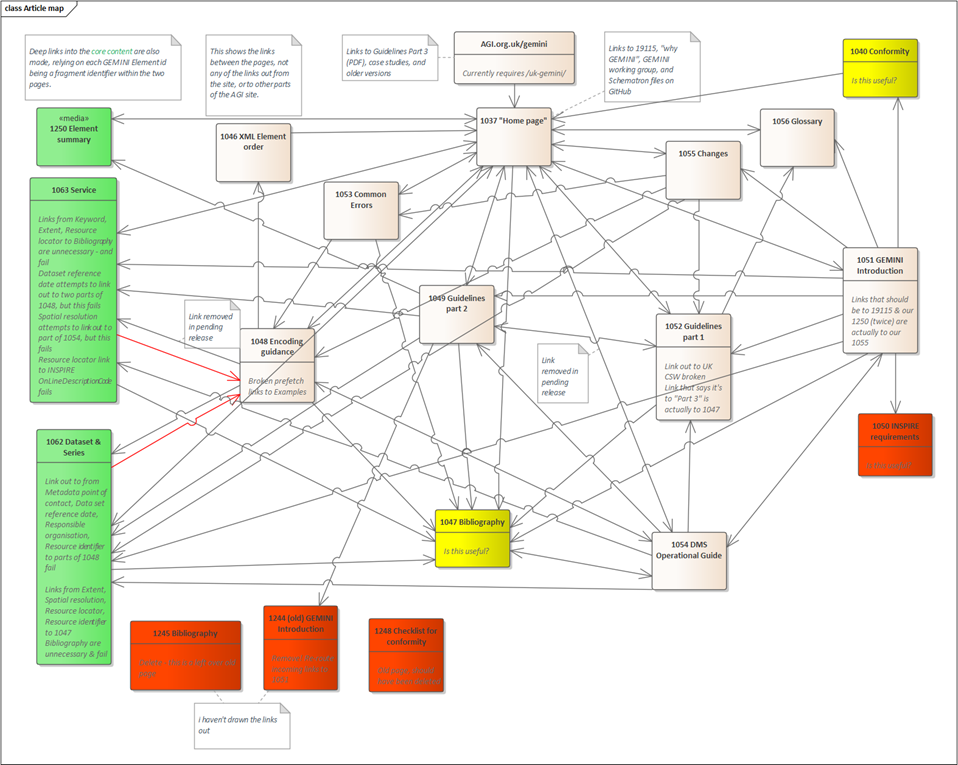

# UK GEMINI consolidated content on the AGI Website

Notes on articles, links, and publishing

Peter Parslow, revised December 2025, removing the "notes on publishing" to the old Blue Star hosted AGI site

# Page list

As at 2021. The numeric part of each URL reflects the article number in the previous web host&#39;s Content Management System. The textual part of the URL reflects a rather old title of the article!

They all work on a stem of [https://www.agi.org.uk/gemini/40-gemini/](https://www.agi.org.uk/gemini/40-gemini/), with [https://www.agi.org.uk/gemini/](https://www.agi.org.uk/gemini/) redirecting to it (i.e. either stem will work).

| **Title** | **Article** | **Last bit of URL** | **Thoughts** |
| --- | --- | --- | --- |
| UK GEMINI standard and INSPIRE implementing rules | 1037 | 1037-uk-gemini-standard-and-inspire-implementing-rules | Change title – this is really the &quot;2.3 home page&quot; | 
| UK GEMINI v2.2 - Specification for discovery metadata for geospatial resources | 1051 | 1051-uk-gemini-v2-2-specification-for-discovery-metadata-for-geospatial-resources | This is really the GEMINI introduction | 
| Metadata Guidelines for Geospatial Data Resources - Part 1 | 1052 | 1052-metadata-guidelines-for-geospatial-data-resources-part-1 | | 
| Metadata Guidelines for Geospatial Data Resources - Part 2 | 1049 | 1049-metadata-guidelines-for-geospatial-data-resources-part-2 | | 
| UK GEMINI Encoding Guidance | 1048 | 1048-uk-gemini-encoding-guidance | | 
| Operational Guide | 1054 | 1054-operational-guide | | 
| Services | 1063 | 1063-gemini-services | From shared content | 
| Datasets &amp; series | 1062 | 1062-gemini-datasets-and-data-series | From shared content | 
| Element summary | 1250 | 1250-element-summary | From shared content | 
| XML Element Order | 1046 | 1046-xml-element-order | Ideally from shared content | 
| COMMON METADATA ERRORS - UK Location Discovery Metadata Service | 1053 | 1053-common-metadata-errors-uk-location-discovery-metadata-service | | 
| UK GEMINI v2.3 major changes since v1.0 | 1055 | 1055-uk-gemini-major-changes-since-1-0 | Also includes minor changes | 
| Glossary | 1056 | 1056-glossary | | 
| Checklist for conformity | 1040 | 1040-checklist-for-conformity | Is this useful? |  
| Checklist for conformity | 1248 | 1248-checklist-for-conformity | Should have been deleted | 
| _Actually the bibliography_ | 1047 | 1047-metadata-guidelines-for-geospatial-data-resources-part-3 | Is this useful?; If this is kept, change URL &amp; incoming links! |  
| INSPIRE metadata requirements | 1050 | 1050-inspire-metadata-requirements | Intention had been to delete | 
| GEMINI Bibliography | 1245 | 1245-gemini-bibliography | Not useful |  
| &quot;Checklist for Conformity 2&quot; (but actually a copy of 1051 with some minor changes!) | 1244 | 1244-uk-gemini-introduction | Should have been deleted | 

